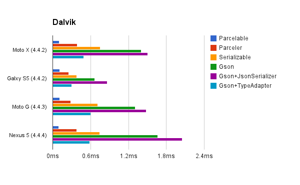

Android中，Activity和Fragment之间传递对象，可以通过将对象序列化并存入Bundle或者Intent中进行传递，也可以将对象转化为JSON字符串，进行传递。

序列化对象可以使用Java的`Serializable`的接口`Parcelable`接口。转化成JSON字符串，可以使用`Gson`等库。

## 1.Serializable

Model

```java

public class Author implements Serializable{
    private int id;

    private String name;

    //...
}

```

```java

public class Book implements Serializable{
    private String title;
    private Author author;
    //...
}

```
传递数据
```java

 Book book=new Book();
        book.setTitle("Java编程思想");
        Author author=new Author();
        author.setId(1);
        author.setName("Bruce Eckel");
        book.setAuthor(author);
        Intent intent=new Intent(this,SecondActivity.class);
        intent.putExtra("book",book);
        startActivity(intent);

```
接收数据

```java
 Book book= (Book) getIntent().getSerializableExtra("book");
        Log.d(TAG,"book title->"+book.getTitle());
        Log.d(TAG,"book author name->"+book.getAuthor().getName());


```

## 2.转化为JSON字符串

Model

```java

public class Author{
    private int id;

    private String name;

    //...
}

```

```java
public class Book{
    private String title;
    private Author author;
    //...
}


```
传递数据

```java
         Book book=new Book();
        book.setTitle("Java编程思想");
        Author author=new Author();
        author.setId(1);
        author.setName("Bruce Eckel");
        book.setAuthor(author);
        Intent intent=new Intent(this,SecondActivity.class);
        intent.putExtra("book",new Gson().toJson(book));
        startActivity(intent);

```
接收数据

```java
 String bookJson=getIntent().getStringExtra("book");
        Book book=new Gson().fromJson(bookJson,Book.class);
        Log.d(TAG,"book title->"+book.getTitle());
        Log.d(TAG,"book author name->"+book.getAuthor().getName());

```

## 3.使用Parcelable

实现`Parcelable`接口需要实现两个方法

* describeContents方法。内容接口描述，默认返回0就可以;

* writeToParcel方法。将传递的数据打包到Parcel容器中。

除了要实现这两个方法还必须创建一个`Parcelable.Creator`接口的实例，用于读取Parcel容器中的数据

Model

```java


public class Author implements Parcelable{
    private int id;

    private String name;

    //setter & getter...

    @Override
    public int describeContents() {

        return 0;
    }

    @Override
    public void writeToParcel(Parcel dest, int flags) {
        //该方法将类的数据写入外部提供的Parcel中.即打包需要传递的数据到Parcel容器保存，
        // 以便从parcel容器获取数据
        dest.writeString(name);
        dest.writeInt(id);

    }
    public static final Creator<Author> CREATOR=new Creator<Author>() {
        @Override
        public Author createFromParcel(Parcel source) {
            //从Parcel容器中读取传递数据值，封装成Parcelable对象返回逻辑层。
            Author author=new Author();
            author.setName(source.readString());
            author.setId(source.readInt());
            return author;
        }

        @Override
        public Author[] newArray(int size) {
            //创建一个类型为T，长度为size的数组，仅一句话（return new T[size])即可。方法是供外部类反序列化本类数组使用。
            return new Author[size];
        }
    };
}


```

```java

public class Book implements Parcelable{
    private String title;
    private Author author;
    //setter & getter...

    @Override
    public int describeContents() {
        return 0;
    }

    @Override
    public void writeToParcel(Parcel dest, int flags) {
        dest.writeString(title);
        dest.writeParcelable(author,flags);
    }
    public static final Creator<Book> CREATOR=new Creator<Book>() {
        @Override
        public Book createFromParcel(Parcel source) {
            Book book=new Book();
            book.setTitle(source.readString());
            book.setAuthor(source.<Author>readParcelable(Author.class.getClassLoader()));
            return book;
        }

        @Override
        public Book[] newArray(int size) {
            return new Book[0];
        }
    };
}

```

传递数据

```java

  Book book=new Book();
        book.setTitle("Java编程思想");
        Author author=new Author();
        author.setId(1);
        author.setName("Bruce Eckel");
        book.setAuthor(author);
        Intent intent=new Intent(this,SecondActivity.class);
        intent.putExtra("book",book);
        startActivity(intent);

```

接收数据

```java
        Book book=getIntent().getParcelableExtra("book");
        Log.d(TAG,"book title->"+book.getTitle());
        Log.d(TAG,"book author name->"+book.getAuthor().getName());


```

## 4.性能分析

[经过测试][why-we-love-parcelable]，我们得到下图的效果



可以看出，通过转换为字符串的速度是最慢的。Seralizable次之，Parcelable比Seralizable快10倍。所以从性能上考虑，我们必定优先选择Parcelable。但是Parcelable有大量重复的模板代码，如何简化这些操作，将是下面主要讲解的内容。


## 5.简化Parcel操作

如果你使用android Studio 可以通过安装[android-parcelable-intellij-plugin]插件，或者自己[配置模板][How templates can save your time?]进行操作。


### 5.1 parceler

除了上面的操作，还有大量的第三方库来简化Parcelable操作。当然使用这些库也许会降低Parcelable的性能。[Parceler][Parceler]就是这样一个库。

Parceler使用非常简单，在定义Model时用`@Parcel`进行注解，在传递数据的时候使用`Parcels`的`wrap`方法来包装成一个`Parcelable`对象。获取数据时用`Parcels`的`unwrap`方法来获取对象。

Model

```java

@Parcel 

public class Author { 

   int id;

    String name;

    //setter & getter...
}

```


```java

@Parcel
public class Book {
    String title;
    Author author;
    //setter & getter
}


```

传递对象

```java

Book book=new Book();
book.setTitle("Java编程思想");
Author author=new Author();
author.setId(1);
author.setName("Bruce Eckel");
book.setAuthor(author);
        Intent intent=new Intent(this,SecondActivity.class);
        intent.putExtra("book", Parcels.wrap(book));
        startActivity(intent);


```


接收对象

```java

  Book book= Parcels.unwrap(getIntent().getParcelableExtra("book"));
  Log.d(TAG,"book title->"+book.getTitle());
  Log.d(TAG,"book author name->"+book.getAuthor().getName());


```

除了Parceler之外，还有如[auto-parcel][auto-parcel],[ParcelableCodeGenerator][ParcelableCodeGenerator],[ParcelableGenerator][ParcelableGenerator]等第三方库，这里我将不进行讲解，有兴趣的朋友，可以自行研究。


[why-we-love-parcelable]: http://prolificinteractive.com/blog/2014/07/18/why-we-love-parcelable/
[android-parcelable-intellij-plugin]: https://github.com/mcharmas/android-parcelable-intellij-plugin
[How templates can save your time?]: http://dmytrodanylyk.com/pages/blog/templates.html
[parceler]: https://github.com/johncarl81/parceler
[auto-parcel]: https://github.com/frankiesardo/auto-parcel
[ParcelableCodeGenerator]: https://github.com/foxykeep/ParcelableCodeGenerator
[ParcelableGenerator]: https://github.com/baoyongzhang/ParcelableGenerator


